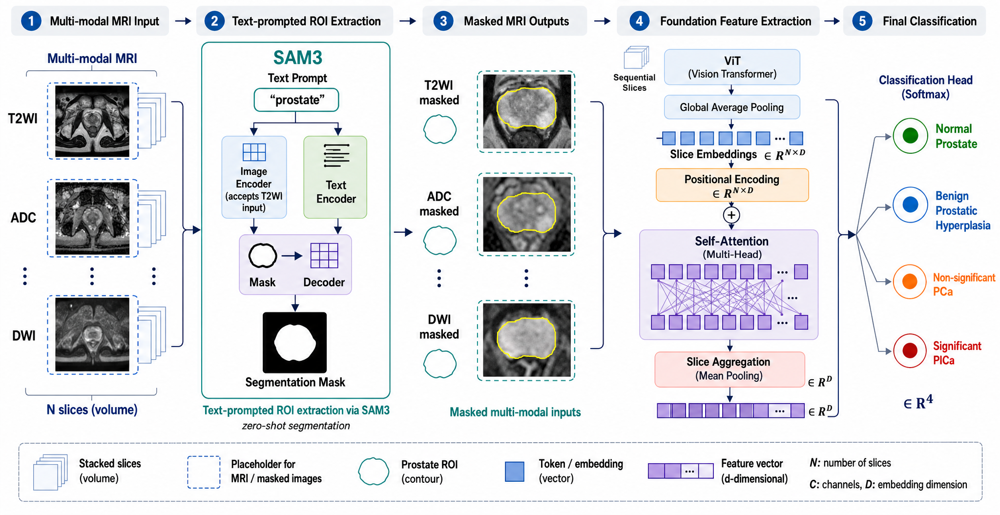

# AGDT: Histopathological Spectrum-Guided Prostate Stratification

Official implementation of AGDT for four-class prostate stratification from
multi-parametric MRI.

**Contributions:**
- **Pathology-grounded benchmark** — A four-class prostate mpMRI dataset with biopsy-confirmed labels, enabling clinically meaningful imaging–pathology research.
- **AGDT (current model)** — Uses text-prompted ProstateSAM3 masks to focus T2WI, ADC, and DWI on anatomically relevant prostate regions, followed by ViT-Large feature extraction and position-aware inter-slice Transformer aggregation.
- **Controlled architecture and mask comparisons** — Supports alternative backbones, mask sources, and a no-mask ablation under the same training pipeline.
- **Cross-institutional generalization** — Strong results on both our benchmark and the public PI-CAI dataset, suggesting clinical utility for risk stratification.

> 🔗 PI-CAI baseline: [github.com/ivel-Li/picai_baseline_classification](https://github.com/ivel-Li/picai_baseline_classification)

---

## Pipeline Overview

```
Raw DICOM/NIfTI (T2WI, ADC, DWI)
  │
  ├── Registration & Normalization
  │     (rigid registration ADC/DWI → T2WI; resample to isotropic; intensity norm)
  │
  ├── HDF5 Packaging ── dataset/build_h5_dataset.py
  │     Extract 16 center slices → resize to 224×224 → min-max norm [0,1]
  │     ➜ dataset/patients_dataset_v1.0.h5
  │       (344 patients, each: ADC, DWI, T2, label)
  │
  ├── ProstateSAM3 Mask Generation ── dataset/generate_post_train_mask.py
  │     T2WI/ADC/DWI per slice → "transition zone" + "peripheral zone"
  │     ➜ /<patient>/post_train_mask (union ROI)
  │     (SAM3 repo: https://github.com/ivel-Li/sam3)
  │
  └── Training & Evaluation ── python main.py
```

### Label Mapping

| Label | Class |
|-------|-------|
| 0 | Normal prostate |
| 1 | Benign prostate cancer |
| 2 | Non-significant prostate cancer |
| 3 | Significant prostate cancer |

Generated HDF5/NIfTI data is intentionally excluded from Git. The preprocessing
scripts recreate the local files under `dataset/`.

### Model Architecture



*Figure 1: AGDT architecture with anatomy-aware ProstateSAM3 ROI extraction.*

The AGDT framework:
1. **Tri-modal input** — 16 axial slices × 3 modalities (T2WI, ADC, DWI) → (3 × 16 × 224 × 224).
2. **Anatomy-guided ROI** — Text-prompted ProstateSAM3 central-gland and peripheral-zone masks are merged and applied to all modalities.
3. **Feature extraction** — A shared ViT-Large/16 backbone extracts one feature vector per slice.
4. **Slice sequential aggregation** — Learnable positional embeddings and a Transformer encoder model dependencies across the ordered slices.
5. **Volume pooling** — Mean pooling produces the patient-level representation.
6. **Classification head** — 4-class output.

---

## Supported Models

### AGDT

| Name | Backbone | Mask | Slice aggregation |
|------|----------|------|-------------------|
| `AGDT` | ViT Large/16 | ProstateSAM3 | Transformer |

`LSDT-Large` remains accepted as a backward-compatible alias for historical
configs and checkpoints. New configs, runs, and result directories use `AGDT`.

### Additional mask-guided backbones (legacy experiment names)

| Name | Backbone |
|------|----------|
| `LSDT-ResNet50` | ResNet50 |
| `LSDT-Swin-T` | Swin Base |
| `LSDT-Base` | ViT Base/16 |
| `LSDT-Large` | ViT Large/16 |
| `LSDT-BiomedCLIP` | BiomedCLIP ViT-B/16 |
| `LSDT-Omnirad` | OmniRad ViT-B/16 |

### Standard classifiers and no-mask ablations

`ResNetClassifier`, `MRIClassifier`, `VITClassifier`, `VITLargeClassifier`,
`VITLargeAttentionClassifier`, `VITLarge21kClassifier`, `VITHugeClassifier`,
`SWINClassifier`, `Biomedclip_vit`, `Omnirad_vit`

> Pretrained weights go in `./weights/`; falls back to random init if absent.

---

## Quick Start

### 1. Setup & Dataset Preprocessing

```bash
# ── Step A: Create environment and install dependencies ────
conda create -n PCa-HSD python=3.10
conda activate PCa-HSD
pip install -r requirements.txt

# ── Step B: Organize raw data ─────────────────────────────
# Place NIfTI volumes under dataset/v1.0/ 

# ── Step C: Build HDF5 dataset ────────────────────────────
python dataset/build_h5_dataset.py

# ── Step D: Generate ProstateSAM3 anatomy masks ───────────
# Install SAM3 for mask generation: https://github.com/facebookresearch/sam3.git
python dataset/generate_post_train_mask.py
```

### 2. Training & Evaluation

```bash
conda activate PCa-HSD

# AGDT with the post-trained ProstateSAM3 union mask
python main.py

# Named ablations
python main.py --config configs/no_mask
python main.py --config configs/vit_base
python main.py --config configs/medicalsam3

# GPU / Seed / Run tag overrides
python main.py --gpu cuda:1
python main.py --seed 123
python main.py --seed 42  --run seed42       # --run avoids overwriting other seeds' output
```

### Key Config (`config.py`)

`config.py` is the single canonical AGDT configuration. Small, named overrides
for ablations live under `configs/`; seed, device, run tag, and fold are CLI
arguments rather than duplicated config files.

| Parameter | Default | Description |
|-----------|---------|-------------|
| `model_name` | `AGDT` | Model architecture |
| `num_epochs` | 150 | Training epochs |
| `batch_size` | 16 | Batch size |
| `num_splits` | 5 | K-fold folds |
| `DATA_EXTAND` | `False` | Concatenate ADC+DWI channels |
| `SupCon` | `False` | Supervised contrastive loss |
| `MASK_KEY` | `post_train_mask` | HDF5 anatomy-mask key |
| `HDF5_PATH` | `"./dataset/patients_dataset_postmask.h5"` | Dataset path |
| `run` | `42` | Run tag → output saved to `./run/{model_name}/{trick_num}/{run}/` |

> 💡 `save_path` is computed as `f"./run/{model_name}/{trick_num}/{run}"`. When running different seeds, use `--run` to keep results separate:
> ```bash
> python main.py --seed 42  --run seed42
> python main.py --seed 123 --run seed123
> python main.py --seed 456 --run seed456
> ```

---

## Project Structure

```
PCa-HSD-AGDT/
├── main.py / config.py / train.py     # Entry, canonical config, training loop
├── configs/                            # Named, minimal ablation overrides
├── data/
│   ├── dataset.py                     # MRIDataset — HDF5 loader
│   └── split.py                       # Stratified K-fold split
├── models/
│   ├── model_factory.py               # build_model() registry
│   ├── base.py / resnet.py / vit.py / bio_vit.py
├── utils/losses.py                    # SupConLoss
├── dataset/
│   ├── build_h5_dataset.py             # NIfTI → HDF5
│   ├── generate_post_train_mask.py     # ProstateSAM3 union masks
│   └── export/infer/merge scripts      # Alternative-mask evaluation
├── tests/                              # Lightweight tests (no weight download)
├── weights/                           # Pretrained checkpoints
└── run/                               # Output directory
```


## PI-CAI Benchmark

Evaluate cross-institutional generalization by pointing `HDF5_PATH` to the PI-CAI HDF5 file (see [preprocessing repo](https://github.com/ivel-Li/picai_baseline_classification)).

---

## Output

```
{run}/fold_{i}/
├── {run}_best_model.pth
├── {run}_training_log.json
├── Tra_Val_Loss.png / Tra_Val_Acc.png
└── fold_{i}_confusion_matrix.png
```

---

## Citation

```bibtex
@article{yourcitation2024,
  title={AGDT: Histopathological Spectrum-Guided Prostate Stratification},
  author={Your Authors},
  journal={Under Review},
  year={2024}
}
```

---

## License & Acknowledgements

- MIT License
- [PI-CAI Baseline](https://github.com/DIAGNijmegen/picai_baseline) — Public benchmark and baseline implementation
- [SAM3](https://github.com/facebookresearch/sam3) — Foundation model for medical image segmentation
- [PI-CAI](https://pi-cai.grand-challenge.org/) — Challenge and dataset
